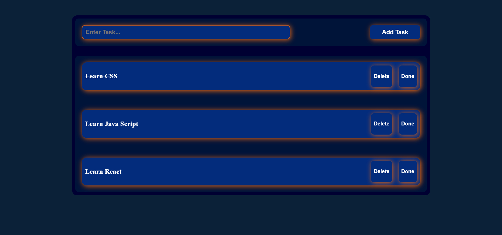

#  To do List

A simple and interactive **Todo List** built with **HTML, CSS, and JavaScript**.
The application allows users to add, complete, and delete tasks while keeping the data saved using **LocalStorage**.

##  Features

*  Add new tasks
*  Delete tasks
*  Mark tasks as completed
*  Save tasks using LocalStorage
*  Tasks remain available after refreshing the page
*  Prevent adding empty tasks
*  Simple and responsive user interface

##  Technologies Used

* HTML5
* CSS3
* JavaScript (ES6)
* DOM Manipulation
* LocalStorage
* JSON

##  Project Structure

```text
Todo-List/
│
├── index.html
├── style.css
├── index.js
└── README.md
```

##  How It Works

### 1. Add Task

When the user enters a task and clicks **Add**, the task is stored as an object:

```js
{
    id: Date.now(),
    text: "Learn JavaScript",
    done: false
}
```

The task is then saved in LocalStorage.

### 2. Display Tasks

When the page loads, the application retrieves the saved tasks from LocalStorage and displays them on the page.

### 3. Complete Task

Clicking the **Done** button changes the task status from:

```js
done: false
```

to:

```js
done: true
```

The completed task is displayed with a line-through effect.

### 4. Delete Task

Each task has its own unique `id`, which allows the application to delete the selected task without affecting the other tasks.

##  LocalStorage

Tasks are stored in the browser using:

```js
localStorage.setItem(
    "taskInformation",
    JSON.stringify(oldTasks)
);
```

And retrieved using:

```js
JSON.parse(
    localStorage.getItem("taskInformation")
);
```

This allows the tasks to remain saved even after refreshing or reopening the page.

##  Learning Goals

This project was created to practice:

* JavaScript DOM Manipulation
* Arrays and Objects
* Functions
* Event Listeners
* CRUD Operations
* LocalStorage
* JSON
* Dynamic HTML Elements

##  Preview



##  Author

**Ghofran Mohamed**

Built as a JavaScript practice project to improve DOM Manipulation and LocalStorage skills.
